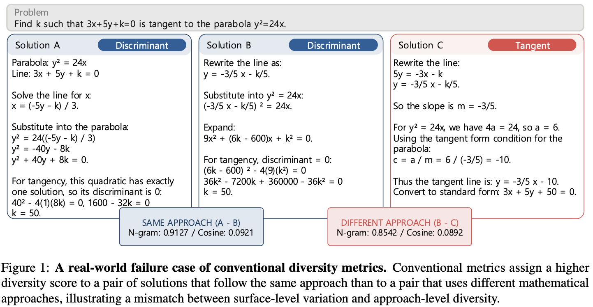

# Are We Measuring Strategy or Phrasing? The Gap Between Surface- and Approach-Level Diversity in LLM Math Reasoning

Official code and data of the paper [Are We Measuring Strategy or Phrasing? The Gap Between Surface- and Approach-Level Diversity in LLM Math Reasoning](https://arxiv.org/abs/2606.29985).

## 📰 News

- 📦 **[2026.09.07]** Code and the multi-approach problem set are released in this repository.
- 🎉 **[2026.08.21]** Our paper is accepted to **EMNLP 2026** as a main conference paper!
- 🏆 **[2026.06.28]** Our paper is accepted to the **ICML 2026 AI4Math Workshop** as a **Spotlight** paper!

## 🔍 Overview



What do we mean by *diversity* in LLM math reasoning? Motivated by recent findings on mode collapse under RLVR and on the value of diverse candidates for test-time scaling, a growing number of works propose diversity-aware training algorithms.
These methods, however, typically operationalize diversity with surface-level signals such as lexical overlap, embedding distance, or the ratio of distinct equations.
This leaves open a more fundamental question: *are models exploring genuinely different ways to solve a problem, or merely producing surface-level variants of the same strategy?*, or in terms of diversity metrics, **are we measuring strategy or phrasing?**

To answer it, we introduce **approach-level diversity**: variation in the underlying solution strategies used to reach a correct answer, beyond differences in wording, notation, or exposition, and measure it with a human-calibrated LLM judge and a set of math problems verified to admit multiple distinct approaches.
Our analysis shows that conventional diversity metrics are poor proxies for approach-level diversity, and that optimizing them does not broaden the strategies a model explores. Please refer to [our paper](https://arxiv.org/abs/2606.29985) for the full findings!

This repository contains the code and data used in our experiments:

1. 📚 **Multi-approach feasible problem set**: 2,467 math problems filtered from the MATH training set that admit three or more distinct, verified solution approaches.
2. 📊 **Coverage evaluation**: the LLM clustering judge and the Coverage@N estimator for approach-coverage analysis of generated solutions.
3. 🔧 **Problem filtering pipeline**: the four-stage pipeline used to collect the problem set.

## 📚 Dataset

The multi-approach feasible problem set (`data/`) contains 2,467 problems filtered from the MATH training set by the pipeline in `filtering/`.


| File               | Problems | Description                                                      |
| ------------------ | -------- | ---------------------------------------------------------------- |
| `data/train.jsonl` | 2,000    | Training split, used for the SFT experiments in the paper        |
| `data/eval.jsonl`  | 467      | Held-out evaluation split, used for main analysis and evaluation |


Each problem contains a list of possible solving approaches, validated by the pipeline which we will introduce later:

```json
{
  "problem": "Points $A,B,C,D,E$ and $F$ lie, in that order, on ...",
  "answer": "\\frac{5}{3}",
  "response": {
    "problem_brief": "...",
    "approaches": [
      {"name": "...", "core_idea": "...", "plan": ["step 1", "step 2", "..."]},
      "..."
    ]
  },
  "num_unique_approaches": 4,
  "judge_result": "EXPLANATION: ..."
}
```

## 🚀 Usage

`pip install -r requirements.txt`, then put your OpenAI key in `.env` (`cp .env.example .env`). Correctness scoring and the feasibility check use a locally served Qwen3-4B (`vllm serve Qwen/Qwen3-4B --port 9000`).

### 1. Clustering solutions by approach

The LLM judge assigns approach labels to correct solutions. Input is one problem per line with `problem`, `solutions` and `scores` (1 = correct, 0 = incorrect). If your generations are not scored yet:

```bash
python evaluate_solutions/verify_solutions.py generations.jsonl \
    --model-name Qwen/Qwen3-4B --api-base http://localhost:9000/v1     # writes generations_scored.jsonl
```

Then cluster the correct solutions:

```bash
cd evaluate_solutions

# OpenAI Batch API (the setting used in the paper)
python sol_diversity_judge.py generations_scored.jsonl \
    --model gpt-5.2 --mode batch --chunk-size 8 --min-correct 4 \
    --output-dir outputs/clustering_results
```

For each problem, the judge returns the observed approach groups and the indexed ids of the correct solutions in each group.
For the exact command used in the paper, refer to `scripts/cluster_generations.sh`.

### 2. Definition of Cov@N

We measure the approach-level diversity of a policy $\pi$ with **expected coverage** $\mathrm{cov}(N, \pi)$: the expected number of distinct approach clusters observed when sampling $N$ *correct* solutions from $\pi$. For a problem $x$, this is defined over sets $S_x$ of $N$ correct samples,

$$
\mathrm{cov}_x(N, \pi) \;=\; \mathbb{E}_{S_x}\big[\,|\mathcal{J}(x, S_x)|\,\big], \qquad |S_x| = N ,
$$

where $\mathcal{J}(x, S_x)$ is the clustering of $S_x$ into approach groups produced by the LLM judge. Coverage captures not only how many approaches a policy covers, but also how evenly it samples across them.

`coverage/metrics.py` computes $\mathrm{cov}_x(N,\pi)$ from the judge's cluster sizes, and `coverage/evaluate.py` runs the whole procedure for one checkpoint (verify sampled solutions → cluster → coverage per problem) with the settings used in the paper in `coverage/configs/eval_config.yaml`:

```bash
cd coverage
python evaluate.py --model-id Qwen2.5-3B --checkpoint step-500 --training-method GRPO \
    --eval-set eval --eval-set-version v1.0 --generations-file path/to/generations.jsonl
python scripts/aggregate_results.py --runs-dir results/runs      # mean cov(N) over problems, AUC
```

### 3. Building a multi-approach problem set

To filter for the problems that admit multiple, genuinely distinct solving approaches, we introduce a four-stage pipeline. 


| Stage                  | Command                                  | Model                      | Keeps                                                                           |
| ---------------------- | ---------------------------------------- | -------------------------- | ------------------------------------------------------------------------------- |
| 1. Difficulty filter   | `filtering/filter_by_avg.py`             | pass@1 of a Qwen3-4B model | problems of appropriate difficulty                                              |
| 2. Approach generation | `filtering/generate_approaches_batch.py` | GPT Judge                  | generates K candidate plans per problem                                         |
| 3. Feasibility check   | `filtering/check_feasible_plans.py`      | Qwen3-4B solver            | plans that Qwen3-4B can execute to a correct answer                             |
| 4. Uniqueness judge    | `filtering/uniqueness_judge.py`          | GPT Judge                  | problems whose feasible plans contain more than 3 genuinely distinct approaches |


```bash
# Stage 1: split problems by pass@1 (edit input_files inside the script), keep medium ones
python filtering/filter_by_avg.py --output-path outputs/stage1/

# Stage 2: generate K=4 approach plans per problem -> <input>_with_plans.jsonl
python filtering/generate_approaches_batch.py --input_file outputs/stage1/medium.jsonl --k 4 --model gpt-5.2

# Stage 3: keep feasible plans -> outputs/stage3/feasible_plans/
python filtering/check_feasible_plans.py \
    --input_file outputs/stage1/medium_with_plans.jsonl \
    --output_file outputs/stage3/feasibility.jsonl \
    --base_url http://localhost:9000/v1 --verifier-base-url http://localhost:9000/v1 \
    --n_rollouts 8

# Stage 4: judge for approach uniqueness -> outputs/stage4/uniqueness_positive.json
python filtering/uniqueness_judge.py \
    --input-file outputs/stage3/feasible_plans/medium_with_plans.jsonl \
    --output-file outputs/stage4/uniqueness.json \
    --model gpt-5.2 --reasoning-effort none
```

## 🗂️ Repository Structure

```
LLM_reasoning_diversity/
├── data/                            # Multi-approach feasible problem set (train / eval)
├── coverage/                        # Coverage@N evaluation
│   ├── evaluate.py                  # Entry point: verify -> cluster -> Coverage@N
│   ├── metrics.py                   # Coverage@N estimator
│   ├── configs/eval_config.yaml     # Verifier / judge / eval-set settings
│   └── scripts/                     # Aggregation (mean Cov@N, AUC) and problem filtering
├── evaluate_solutions/              # LLM judge for approach clustering
│   ├── sol_diversity_judge.py       # Clustering judge (batch / realtime)
│   ├── verify_solutions.py          # Correctness scoring with Qwen3-4B
│   ├── utils.py                     # Judge prompt
│   └── scripts/                     # Launch scripts used in the paper
├── filtering/                       # Four-stage problem filtering pipeline
│   ├── filter_by_avg.py             # Stage 1
│   ├── generate_approaches_batch.py # Stage 2
│   ├── check_feasible_plans.py      # Stage 3
│   └── uniqueness_judge.py          # Stage 4 (prompt in uniqueness_judge_utils.py)
├── .env.example                     # OPENAI_API_KEY template
└── requirements.txt
```

## 📝 Citation

If you found our work helpful, kindly cite our work!

```bibtex
@misc{lee2026measuringstrategyphrasinggap,
      title={Are We Measuring Strategy or Phrasing? The Gap Between Surface- and Approach-Level Diversity in LLM Math Reasoning}, 
      author={Sangmook Lee and Minbeom Kim and Jeonghye Kim and Dohyung Kim and Sojeong Rhee and Kyomin Jung},
      year={2026},
      eprint={2606.29985},
      archivePrefix={arXiv},
      primaryClass={cs.CL},
      url={https://arxiv.org/abs/2606.29985}, 
}
```

